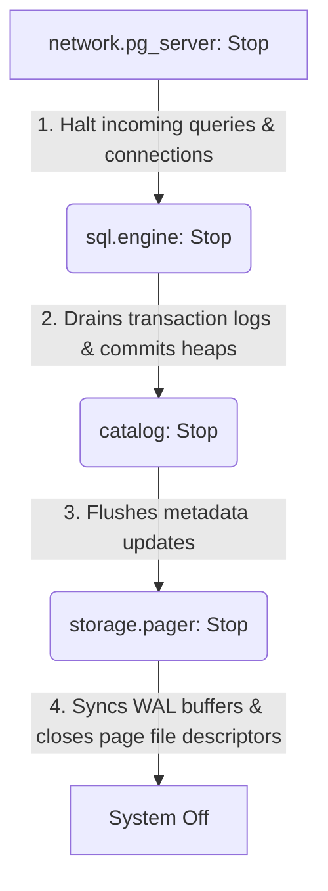

# System Composition & Configuration Wiring

| Field | Value |
| :--- | :--- |
| **Source** | `agent/wiring_main.md` |
| **Package(s)** | `internal/config`, `internal/runtime`, `cmd/plomvix` |
| **Purpose** | Extend configuration structures to support storage pager, SQL limits, and PostgreSQL server parameters; wire all decoupled layers into a lifecycle-managed daemon booted from `main.go`. |
| **Dependencies** | Setup and Enterprise plans for Pager, Heap, SQL Engine, and Wire Protocol. |

## Honest Contracts & Known Trade-offs

1. **Strict Dependency Order Assembly:** Components must be registered with the lifecycle manager in strict dependency order during initialization. During shutdown, the lifecycle manager halts them in reverse order (LIFO) to guarantee that dependent systems drain successfully before their underlying storage layers close.
2. **Fail-Fast Initialization:** If any component configuration validation or startup handshake fails (e.g., binding to TCP port, opening database file, initializing WAL), the daemon must abort immediately with a non-zero exit code.
3. **Stale Backend Config Elimination:** The configuration schema must remove old references to `bbolt` and `pebble` storage engines, replacing them with parameters for the custom Pager, WAL, and MVCC storage system.
4. **Fallback Default Configurations:** Missing config file entries must default to safe in-memory configurations or standard developer paths (e.g. `data/plomvix.db`, localhost PG port `5432`).

---

## Deliverables

| File | Purpose |
| :--- | :--- |
| `internal/config/config.go` | Extend configuration structs (Server, SQL, Storage) and add validation/normalization checks. |
| `config.example.toml` | Provide a fully documented TOML configuration template. |
| `config.toml` | Default runtime configuration file mapping local paths and PostgreSQL connection ports. |
| `internal/runtime/runtime.go` | Rewrite runtime composition logic to initialize, inject, and register all storage, engine, and server layers to the lifecycle hook manager. |
| `cmd/plomvix/main.go` | Adapt CLI flag parsing to load configurations and pass runtime context. |

---

## Key API & Concepts

### 1. Unified Configuration Schema (`internal/config/config.go`)

We extend `Config` to capture storage pager limits, vacuum schedules, and PostgreSQL server credentials.

```go
package config

type Config struct {
	Server ServerConfig `toml:"server"`
	Logger LoggerConfig `toml:"logger"`
	SQL    SQLConfig    `toml:"sql_engine"`
	Store  StoreConfig  `toml:"storage"`
}

type ServerConfig struct {
	Host           string `toml:"host"`
	Port           int    `toml:"port"`
	MaxConnections int64  `toml:"max_connections"`
	SSLEnabled     bool   `toml:"ssl_enabled"`
	SSLCertPath    string `toml:"ssl_cert_path"`
	SSLKeyPath     string `toml:"ssl_key_path"`
	AuthType       string `toml:"auth_type"` // "trust", "md5", "scram-sha-256"
}

type SQLConfig struct {
	DataDir         string `toml:"data_dir"`
	MaxMutationRows int    `toml:"max_mutation_rows"` // 0 = default 1000, -1 = disabled
	VacuumWorkers   int    `toml:"vacuum_workers"`
	VacuumQueueSize int    `toml:"vacuum_queue_size"`
}

type StoreConfig struct {
	DBPath       string `toml:"db_path"`
	WALPath      string `toml:"wal_path"`
	CacheSizeMB  int    `toml:"cache_size_mb"`
	SyncWrites   bool   `toml:"sync_writes"`
	MaxOpenFiles int    `toml:"max_open_files"`
}
```

### 2. Lifecycle Dependency Registration (`internal/runtime/runtime.go`)

The `New` and `Start` methods in `internal/runtime/runtime.go` compose the database system.

```go
func New(opts Options) (*Runtime, error) {
	resolved, err := resolveOptions(opts)
	if err != nil {
		return nil, err
	}

	// 1. Load config
	cfg, err := config.Load(resolved.ConfigPath)
	if err != nil {
		return nil, fmt.Errorf("%w: %w", ErrLoadConfig, err)
	}

	baseLog, err := logger.New(cfg.Logger)
	if err != nil {
		return nil, fmt.Errorf("%w: %w", ErrCreateLogger, err)
	}
	log := logger.WithComponent(baseLog, "runtime")

	// Create boot context for system heaps initialization
	bootCtx, cancel := context.WithTimeout(context.Background(), resolved.StartupTimeout)
	defer cancel()

	// 2. Initialize System Heaps & Global Catalog
	sysFactory := system.NewFactory(cfg.SQL.DataDir)
	sysTables, sysColumns, sysUsers, err := sysFactory.OpenOrCreateSystemHeaps(bootCtx)
	if err != nil {
		return nil, fmt.Errorf("runtime: init system heaps: %w", err)
	}
	cat := catalog.NewWithStores(sysTables, sysColumns, sysUsers)

	// 3. Initialize Custom Pager & KVStore for User Tables
	if err := os.MkdirAll(filepath.Dir(cfg.Store.DBPath), 0755); err != nil {
		return nil, fmt.Errorf("runtime: create data dir: %w", err)
	}
	sharedPager := pager.NewWithOptions(cfg.Store.DBPath, pager.Options{
		WALPath: cfg.Store.WALPath,
	})
	sharedKV := kv.New(sharedPager)

	// 4. Initialize HeapManager (TableRegistry), TxManager, Vacuum, and RowDecoder
	heapMgr := sql.NewHeapManager(sharedKV, cfg.SQL.DataDir)
	txMgr := tx.NewManager(1, 1)
	vacMgr, err := vacuum.NewManager(cfg.SQL.VacuumWorkers, cfg.SQL.VacuumQueueSize)
	if err != nil {
		return nil, fmt.Errorf("runtime: create vacuum manager: %w", err)
	}
	planCache := planner.NewPlanCache(128)
	rowDecoder := sql.NewRowDecoder()

	// 5. Initialize SQL Engine & Register it with Catalog
	sqlEngine, err := sql.NewSQLEngine(sql.SQLEngineConfig{
		Catalog:         cat,
		Versions:        cat,
		TableManager:    heapMgr,
		Decoder:         rowDecoder,
		PlanCache:       planCache,
		TxManager:       txMgr,
		VacuumManager:   vacMgr,
		Logger:          logger.WithComponent(baseLog, "sql-engine"),
		MaxMutationRows: cfg.SQL.MaxMutationRows,
	})
	if err != nil {
		return nil, fmt.Errorf("runtime: create sql engine: %w", err)
	}
	if err := cat.RegisterEngine(sqlEngine); err != nil {
		return nil, fmt.Errorf("runtime: register sql engine: %w", err)
	}

	// 6. Initialize Router & SQL Parser
	routerService := router.New(cat)
	routerService.RegisterEngine(sqlEngine)
	parserService, err := sqlparser.New()
	if err != nil {
		return nil, fmt.Errorf("runtime: create parser: %w", err)
	}

	// 7. Initialize PostgreSQL Wire Protocol Server
	pgServer := server.New(
		fmt.Sprintf("%s:%d", cfg.Server.Host, cfg.Server.Port),
		routerService,
		parserService,
	)

	// 8. Register components with lifecycle manager in LIFO start/stop order
	manager := lifecycle.NewManager()
	manager.Register("storage.pager", sharedPager.Open, sharedPager.Close)
	manager.Register("storage.kv", sharedKV.Open, sharedKV.Close)
	manager.Register("catalog", cat.Start, cat.Stop)
	manager.Register("vacuum", vacMgr.Start, vacMgr.Stop)
	manager.Register("network.pg_server", pgServer.Start, pgServer.Stop)

	return &Runtime{
		opts:    resolved,
		cfg:     cfg,
		log:     log,
		manager: manager,
	}, nil
}
```

### 3. Graceful Shutdown Ordering (LIFO Execution)

Shutdown must proceed in the **reverse order** of initialization:



---

## Tasks

1. **Extend configuration structures:** Update `internal/config/config.go` with `StoreConfig`, security SSL configurations, and database engine settings. Replace old bbolt/pebble validation rules with the new schema validation logic.
2. **Update TOML configuration templates:** Populate `config.example.toml` and write the default runtime `config.toml` containing localhost postgres port `5432`, `MaxMutationRows = 1000`, and storage paths.
3. **Rewrite Runtime wiring pipeline:** Redefine `New()` inside `internal/runtime/runtime.go` to construct the storage pager, catalog services, SQL compiler engines, and server listener layers, registering their hooks sequentially into the lifecycle manager.
4. **Implement flag parsing in `main.go`:** Integrate CLI flags in `cmd/plomvix/main.go` supporting config path mappings (e.g. `--config config.toml`) and port override variables.
5. **Add wiring validation tests:** Write integration tests in `internal/runtime/wiring_test.go` checking that a runtime boot succeeds, initializes file databases, binds TCP connections, and tears down cleanly under LIFO lifecycle controls.

---

## Completion Criteria

- [ ] Configuration files validate pager caches, DML limits, and network parameters accurately.
- [ ] Running `plomvix` binary starts the database system in a single command.
- [ ] Network listener accepts driver sessions after the daemon boot sequence.
- [ ] Standard OS shutdown signals trigger LIFO tear downs without data loss.
- [ ] Database files and WAL handles close cleanly post-execution.
