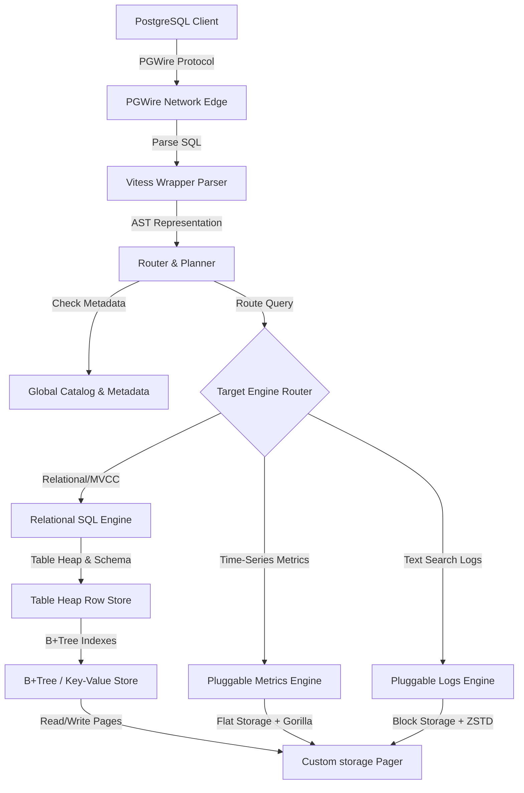

# Plomvix Architecture & Subsystem Guide

This guide describes the internals of Plomvix, a high-performance, pluggable database designed to handle relational queries, structured metrics, and schema-less logs using a custom database storage engine.

---

## 1. Subsystem Architecture Overview

The following workflow illustrates the path of a query through the Plomvix runtime:



---

## 2. Low-Level Custom Storage

Plomvix avoids dependencies on databases like BoltDB or Pebble by building its own robust, transactional storage layer on top of raw 4KB physical pages.

### The Custom Pager (`internal/storage/pager`)
The bottom-most layer interfaces with the file system.
* **4KB Format Structure:** Divided into a 12-byte header (Page ID + CRC32 checksum) and 4084 bytes of payload.
* **Header Redundancy:** Page 0 (primary metadata) is mirrored at Page 1. The primary header is written only after the mirror has successfully completed and fsync'd.
* **Transactional WAL:** Writes are logged to a Write-Ahead Log (`.wal`). Transactions commit with an End-of-Transaction (EOT) marker. Replaying the WAL on boot recovers completed transactions and discards incomplete, torn writes.
* **Free-List Recycler:** Freed page IDs are tracked in a singly-linked list embedded within the body of freed data pages.

### Custom B+Tree KVStore (`internal/engine/sql/kv`)
Provides standard key-value indexing.
* **Shadow-Paging Compaction:** Pages are modified using copy-on-write (shadow paging), ensuring index structural updates are crash-atomic.
* **TOAST Overflow:** Large keys or values exceeding the page budget are split off into linked overflow (TOAST) pages.

### Table Heap (`internal/engine/sql/heap`)
Implements row storage for relational tables.
* **MVCC Slots:** Row slots record insertion/deletion transactions using timestamps.
* **Vacuum Worker:** A background daemon processes freed slots and cleans up dead rows.

---

## 3. Relational Execution Path

Provides ANSI SQL query processing capabilities.
* **Global SQL Parser:** Wraps a Vitess SQL parsing driver to check syntax, fingerprint queries, and compile parameters.
* **Planner/Optimizer:** Evaluates execution paths, compiling relational plans using the Volcano iterator model (producing Row Streams).
* **Volcano Execution Engine:** Processes physical execution operators including Nested Loop and Hash Joins, Sorting (`ORDER BY`), and Aggregation (`GROUP BY`, `LIMIT`).

---

## 4. Pluggable Engines (Observability Extensions)

To bypass the write overhead of indexes in metrics and logs workloads, Plomvix implements specialized pluggable engines.

### 4.1 Metrics Engine (`internal/engine/metrics`)
Designed for high-throughput numeric time-series points.
* **Storage Layout:** Raw metric points are written sequentially to flat pages.
* **Gorilla compression:** Double-delta compression shrinks timestamps, while XOR bit-packing compresses floating-point sensor values by up to 10x.
* **In-Memory Tag Index:** Speeds up label filters using a concurrent `sync.RWMutex`-protected inverted tag map bounded by a rolling 24-hour LRU cache.
* **Rollup Worker:** A background daemon consolidates raw metric points into 1-minute and 5-minute aggregation buckets, writing them to a separate `data/metrics_rollups.db` page file.

### 4.2 Logs Engine (`internal/engine/logs`)
Optimized for high-speed text search and ingestion of JSON and raw system logs.
* **Block Compression:** Log records are aggregated in memory, compressed using **ZSTD**, and written sequentially to disk.
* **Block Chunking:** The `BlockWriter` and `BlockReader` sit on top of the raw pager to transparently slice compressed blocks across multiple contiguous physical pages.
* **In-Memory Token Index:** Log message bodies are tokenized into lowercase alphanumeric terms. Terms are indexed in memory with an LRU cache limited by `LogIndexMaxMemoryMB`.
* **Block Directory:** Tracks page allocations in memory to prevent the Retention Worker from attempting to scan raw physical pages that have been deleted and returned to the Pager's free-list.

---

## 5. Development and Collaboration

### Directory Structure
```
├── agent/                # Design documents and execution plans
├── cmd/
│   └── plomvix/          # Main CLI and database entry point
├── docs/                 # Subsystem and user documentation
├── internal/
│   ├── catalog/          # Table schema and IAM metadata
│   ├── config/           # Server configuration loading and validation
│   ├── engine/
│   │   ├── logs/         # Pluggable Logs Engine
│   │   ├── metrics/      # Pluggable Metrics Engine
│   │   └── sql/          # Core Relational SQL Engine (Heap, KV, Key, Parser)
│   ├── lifecycle/        # Graceful startup and LIFO shutdown hooks
│   ├── logger/           # Structured slog and credential redaction
│   ├── router/           # SQL command routing and Zero-DDL handler
│   ├── runtime/          # Lifecycle orchestration and dependency wiring
│   ├── server/           # PostgreSQL Wire network protocol implementation
│   └── storage/
│       └── pager/        # 4KB Transactional Pager layer
└── status.md             # Project master execution matrix
```

### Running Test Suites
Run the full test suite including all custom storage, relational, and pluggable engine test suites:
```bash
go test ./...
```

To run tests in a specific package with verbosity:
```bash
go test -v ./internal/engine/logs
```

### Updating the Navigation Graph
If you modify function signatures, add packages, or restructure models, run `graphify` to sync the AST navigation graph:
```bash
graphify update .
```
