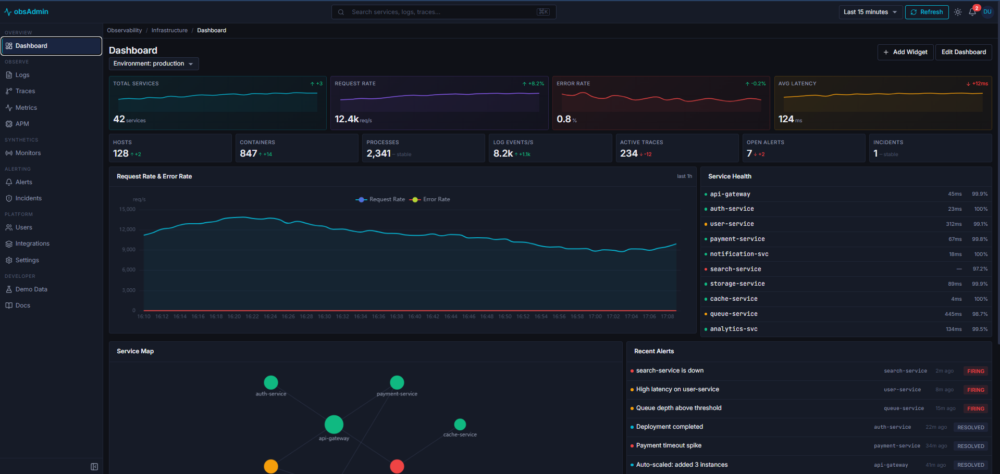

# obsAdmin — Observability Platform UI Theme

A production-ready React dashboard for observability, monitoring, and incident management. Built with **React 19 + TypeScript + MUI v9 + Vite**.

## Quick Start

```bash
git clone https://github.com/gamaops112/obs_theme.git
cd obs_theme/obsAdmin
npm install
npm run dev
```

**[&#9654; Live Demo](https://gamaops112.github.io/obs_theme/)** — Try it now. Demo credentials pre-filled.



Demo credentials: `demo@obsadmin.io` / `ObsAdmin@demo`

## Stack

| Layer | Technology |
|---|---|
| Framework | React 19 + TypeScript 6 |
| Build | Vite 8 |
| UI | MUI v9 (@mui/material) |
| Routing | React Router v7 |
| State | Zustand v5 (persisted) |
| Charts | ECharts 6 + echarts-for-react |
| Forms | React Hook Form + Zod |
| Editor | Monaco Editor (@monaco-editor/react) |
| Virtualization | TanStack Virtual |
| Time | dayjs + @vvo/tzdb |
| Icons | Lucide React |
| Toasts | Sonner |
| Auth | Demo JWT (no backend) |

## Project Structure

```
src/
├── App.tsx                          # Router + AuthGuard
├── main.tsx                         # ThemeProvider + ThemedApp
├── layout/
│   ├── AppShell.tsx                  # Topbar + Sidebar + Breadcrumbs + Toaster
│   ├── Sidebar.tsx                   # Collapsible nav (220px/56px)
│   ├── Topbar.tsx                    # Search bar, user menu, theme toggle, notifications
│   └── navConfig.ts                  # All navigation sections
├── theme/
│   └── index.ts                      # darkTheme + lightTheme + getDensityTokens()
├── store/
│   ├── uiStore.ts                    # Theme mode, sidebar state
│   ├── settingsStore.ts              # Timezone, density, sidebar toggles
│   └── authStore.ts                  # Demo login + JWT management
├── lib/
│   ├── auth.ts                       # Token generation/validation
│   └── toast.ts                      # Sonner wrapper (notify.success/error/etc.)
├── components/
│   ├── common/                       # EmptyState, ErrorBoundary, GlobalSearch,
│   │                                  NotificationBell, PageSkeleton, ThemeToggle, TimezoneSelect
│   └── guards/AuthGuard.tsx          # Route protection wrapper
└── pages/
    ├── dashboard/                     # Phase 2 — ColorMetricCards, StatTiles, TimeSeries, ServiceMap
    ├── logs/                          # Phase 3 — Virtualized table, histogram, filters, live tail
    ├── metrics/                       # Phase 4 — Hosts table, metrics explorer, host detail
    ├── traces/                        # Phase 5 — Trace list, span waterfall, trace detail
    ├── apm/                           # Phase 5 — Service cards, service map, error tracking
    ├── alerts/                        # Phase 6 — Firing alerts, alert rules, notification channels
    ├── incidents/                     # Phase 6 — Incidents list, timeline, incident detail
    ├── synthetics/                    # Phase 7C — Monitors, status page, uptime grid
    ├── users/                         # Phase 7D — Members, roles, audit log
    ├── integrations/                  # Phase 7D — Integration cards grid
    ├── settings/                      # Phase 7B — General, Appearance, Data Sources, API Keys
    ├── profile/                       # Phase 7B — Profile, password, notifications, API keys
    ├── auth/                          # Phase 8 — Login, forgot password
    ├── demo/                          # Phase 7C — Demo data loader
    └── docs/                          # Phase 7E — Documentation cards
```

**98 source files** across 13 page modules, 3 layout files, 8 common components, and 3 stores.

## Theme System

### Dual Theme Architecture

The theme system uses two complete `createTheme()` calls — not a single theme with `palette.mode` toggling:

```tsx
// src/theme/index.ts
export const darkTheme = createTheme({ palette: { mode: 'dark', ... }, components: { ... } });
export const lightTheme = createTheme({ palette: { mode: 'light', ... }, components: { ... } });
```

```tsx
// src/main.tsx
function ThemedApp() {
  const themeMode = useUIStore((s) => s.themeMode);
  const theme = themeMode === 'dark' ? darkTheme : lightTheme;
  return <ThemeProvider theme={theme}><CssBaseline /><App /></ThemeProvider>;
}
```

This is necessary because component overrides differ between themes (button colors, input borders, table header backgrounds, etc.).

### Design Tokens

All tokens defined in `src/theme/index.ts`:

**Dark Theme Palette:**
- Page background: `#0f1117`
- Surface (cards/panels): `#161b27`
- Elevated (dropdowns/tooltips): `#1c2333`
- Hover: `#1e2438`
- Selected: `#1a2540`
- Primary accent (cyan): `#06b6d4`
- Text primary: `#e8eaf0`
- Text secondary: `#8b93a8`
- Text disabled: `#4d566b`
- Divider: `#1f2535`

**Light Theme Palette:**
- Page background: `#f4f5f7`
- Surface: `#ffffff`
- Elevated: `#f9fafb`
- Primary accent: `#0891b2`
- Text primary: `#111827`
- Text secondary: `#6b7280`
- Divider: `#e5e7eb`

### Elevation Model

No box-shadows. Elevation is expressed exclusively through background color steps:

| Level | Dark | Light |
|---|---|---|
| 0 — Page | `#0f1117` | `#f4f5f7` |
| 1 — Surface | `#161b27` | `#ffffff` |
| 2 — Elevated | `#1c2333` | `#f9fafb` |
| 3 — Hover | `#1e2438` | `#f3f4f6` |

### Typography

- **UI font:** Inter (Google Fonts, 400/500/600)
- **Mono font:** JetBrains Mono (Google Fonts, 400/500)
- **Custom variants:** `mono`, `metric` (28px), `metricSm` (20px), `caption2` (11px)
- **Base size:** 13px — optimized for data-dense dashboards

### Density System

Three density levels, applied immediately via settings store:

```tsx
import { getDensityTokens } from '../theme';
const { density } = useSettingsStore();
const { tableRowHeight } = getDensityTokens(density);
// compact: 28px, default: 36px, comfortable: 44px
```

## Using This Theme in Your Project

### 1. Copy the theme structure

```
src/theme/index.ts         # darkTheme + lightTheme + getDensityTokens()
src/store/uiStore.ts       # themeMode + toggleThemeMode
src/main.tsx               # ThemedApp wrapper pattern
```

### 2. Wrap your app

```tsx
// main.tsx
import { darkTheme, lightTheme } from './theme';
import { useUIStore } from './store/uiStore';

function ThemedApp() {
  const themeMode = useUIStore((s) => s.themeMode);
  return (
    <ThemeProvider theme={themeMode === 'dark' ? darkTheme : lightTheme}>
      <CssBaseline />
      <App />
    </ThemeProvider>
  );
}
```

### 3. Add Google Fonts

```html
<!-- index.html -->
<link href="https://fonts.googleapis.com/css2?family=Inter:wght@400;500;600&family=JetBrains+Mono:wght@400;500&display=swap" rel="stylesheet" />
```

### 4. Use theme tokens in components

Always use theme palette values, never hardcoded hex:

```tsx
// CORRECT — responds to theme mode
sx={{ color: 'text.secondary', bgcolor: 'background.paper', borderColor: 'divider' }}

// WRONG — stays dark in light mode
sx={{ color: '#8b93a8', background: '#161b27', borderBottom: '1px solid #1f2535' }}
```

For ECharts instances, pass theme tokens to chart options:

```tsx
const theme = useTheme();
const option = useMemo(() => ({
  tooltip: {
    backgroundColor: theme.palette.background.elevated,
    borderColor: theme.palette.divider,
    textStyle: { color: theme.palette.text.primary },
  },
  xAxis: {
    axisLabel: { color: theme.palette.text.disabled },
    axisLine: { lineStyle: { color: theme.palette.divider } },
  },
  yAxis: {
    splitLine: { lineStyle: { color: theme.palette.divider } },
  },
}), [theme]);
```

### 5. Semantic colors (stay constant)

These colors do NOT change with theme — they carry meaning:

| Token | Color | Meaning |
|---|---|---|
| `status.success` | `#10b981` | Healthy, ok, passing |
| `status.warning` | `#f59e0b` | Degraded, slow |
| `status.error` | `#ef4444` | Down, critical |
| `status.info` | `#06b6d4` | Informational |

### 6. Spacing system

Base unit: 4px. Always use multiples of 4:
- `4px` — inline gaps, icon padding
- `8px` — tight internal padding
- `12px` — default component padding
- `16px` — card padding, form gaps
- `24px` — section gaps, page padding
- `32px` — major layout gaps

### 7. Shape & Radius

Intentionally flat — no 8px+ radius on cards:
- `3px` — badges, chips, tags
- `4px` — buttons, inputs, cards
- `6px` — modals, large panels

## Component Library

### Layout Components

| Component | Description |
|---|---|
| `AppShell` | Root layout: Topbar (48px) + Sidebar + Breadcrumbs (32px) + Content + Toaster |
| `Sidebar` | Collapsible (220px/56px), 6 nav sections, section labels, active state |
| `Topbar` | Search bar (⌘K), time range picker, refresh, theme toggle, notification bell, user avatar menu |
| `GlobalSearch` | ⌘K modal with keyboard navigation, service/page search |
| `NotificationBell` | Popover with unread badge, severity dots, mark-all-read |

### Common Components

| Component | Usage |
|---|---|
| `AuthGuard` | Route protection — redirects to `/login` |
| `ErrorBoundary` | Class component catching render errors |
| `EmptyState` | Centered icon + message + optional action button |
| `PageSkeleton` | 5 variants (table/cards/chart/dashboard/detail), 1200ms delay |
| `ThemeToggle` | Sun/Moon icon button (placed in Topbar + Settings) |
| `TimezoneSelect` | `@vvo/tzdb` Autocomplete, grouped by continent |

### Page Modules

**Dashboard** — 5 rows: colored metric cards (gradient + sparklines), stat tiles (Datadog-style), time series chart + service health grid, service map + recent alerts, logs preview + traces preview.

**Logs Explorer** — Toolbar (search + Monaco query editor toggle), filters sidebar (Services/Levels/Hosts accordions), 40vh ECharts histogram (collapsible), TanStack Virtual log table (28px rows, inline expansion), live tail (800ms interval, pause on hover), detail drawer (Fields/Raw JSON/Trace tabs).

**Metrics & Infrastructure** — Two tabs: Infrastructure (colored host cards + OS/cloud filters + host table with CPU/Memory progress bars + host detail drawer) and Metrics Explorer (query builder + multi-series chart + preset metric tiles + service metrics table with color-coded error% and P99).

**Traces & APM** — Traces page: 3 tabs (Overview with latency percentile chart + Traces list with filter toolbar + Service Map). APM page: service overview cards (3-col grid), interactive service map (click nodes for detail popover), latency chart (P50/P95), error tracking table with detail drawer.

**Alerts & Incidents** — Alerts: 3 tabs (Firing Alerts with summary bar + Alert Rules with inline Switch toggle + Notification Channels grid). CreateAlertModal with Zod validation. Incidents: table with severity/status chips + timeline with colored event dots + note input.

**Settings** — 6 tabs: General (TimezoneSelect), Appearance (theme radio + density RadioGroup + sidebar toggles with instant apply), Data Sources, Notifications, Team, API Keys.

**Synthetics** — 2 tabs: Monitors (toolbar with search/type/status filters + actions column + CreateMonitorModal with React Hook Form + MonitorDetailDrawer with 3-tab detail). Status Page (dynamic overall status + incident history + 90-day uptime grid with tooltips).

**Users** — 3 tabs: Members (search/role/status filters + inline role change + actions column + CreateUserModal with password strength indicator), Roles (3-column cards), Audit Log (20 entries with colored action icons + pagination).

**Auth** — Split-screen login (left: branding, right: SSO buttons + login form pre-filled with demo credentials). Forgot password with success state.

**Demo Data** — 5 mock dataset rows with Reload/Clear handlers + Load All / Clear All buttons.

**Docs** — 6-section card grid (Getting Started, Features, API Reference, Community, Self-Hosting, Integrations).

### State Management

3 Zustand stores, all persisted to localStorage:

| Store | Key | Purpose |
|---|---|---|
| `uiStore` | `sidebarCollapsed`, `themeMode` | UI state + theme toggle |
| `settingsStore` | `timezone`, `density`, `showSectionLabels`, `showIcons`, etc. | User preferences |
| `authStore` | `user`, `token`, `isAuthenticated` | Demo JWT login/logout |

### Toast System

```tsx
import { notify } from '../lib/toast';
notify.success('Alert silenced for 1 hour');
notify.error('Alert rule deleted');
notify.info('SSO not configured in demo mode');
notify.loading('Loading demo data...');
```

### Chart Pattern

All ECharts instances follow this pattern for theme-aware rendering:

```tsx
import ReactEChartsCore from 'echarts-for-react/esm/core';
import * as echarts from 'echarts/core';
import { LineChart } from 'echarts/charts';
import { GridComponent, TooltipComponent, LegendComponent } from 'echarts/components';
import { CanvasRenderer } from 'echarts/renderers';

echarts.use([LineChart, GridComponent, TooltipComponent, LegendComponent, CanvasRenderer]);

const theme = useTheme();
const option = useMemo(() => ({
  // ... use theme.palette.* for all UI chrome colors
}), [theme]);

<ReactEChartsCore echarts={echarts} option={option} style={{ height: 280 }} notMerge />
```

### MUI v9 Notes

This project uses MUI v9 which has breaking changes from v5:
- `InputProps` → `slotProps.input`
- `PaperProps` → `slotProps.paper`
- `ListboxProps` → `slotProps.listbox`
- `MenuProps` → `slotProps` (on Select/Menu)
- Grid uses `size` prop instead of `xs`/`md` (supports objects: `size={{ xs: 12, md: 6 }}`)
- `Grid item` → `Grid` (flat, no item wrapper needed)

## Routes

| Path | Page |
|---|---|
| `/login` | Login page (public) |
| `/forgot-password` | Forgot password (public) |
| `/` | Dashboard |
| `/logs` | Logs Explorer |
| `/traces` | Traces list |
| `/traces/:id` | Trace detail full page |
| `/metrics` | Metrics & Infrastructure |
| `/metrics/hosts/:id` | Host detail page |
| `/apm` | APM overview |
| `/synthetics` | Synthetics monitors |
| `/alerts` | Alerts |
| `/alerts/:id` | Alert detail |
| `/incidents` | Incidents |
| `/incidents/:id` | Incident detail |
| `/users` | User management |
| `/profile` | User profile |
| `/integrations` | Integration cards |
| `/settings` | Settings |
| `/demo` | Demo data loader |
| `/docs` | Documentation |
| `*` | 404 Not Found |

## Design Principles

1. **Dark-first, light-capable.** Theme exists as two complete `createTheme()` calls.
2. **Color carries meaning.** Green = healthy, amber = warning, red = error. Never decorative.
3. **Flat elevation.** No box-shadows — depth is expressed through background color steps.
4. **Compact density.** 13px base font, 36px default table rows, 4px spacing unit.
5. **Theme tokens everywhere.** Zero hardcoded hex in component files. Use `sx` or `useTheme()`.
6. **Monospace for data.** All log lines, trace IDs, timestamps, metric values use JetBrains Mono.
7. **Immediate feedback.** Density, sidebar toggles, timezone — apply instantly via Zustand persist.

## Getting Started as a Base Template

1. Clone and install
2. Replace `demo@obsadmin.io` credentials in `src/store/authStore.ts`
3. Replace mock data in each `mockData.ts` with real API calls
4. Customize `navConfig.ts` sections and icons
5. Adjust `darkTheme`/`lightTheme` palette colors to match your brand
6. Build your own pages following the existing patterns

## License

MIT
